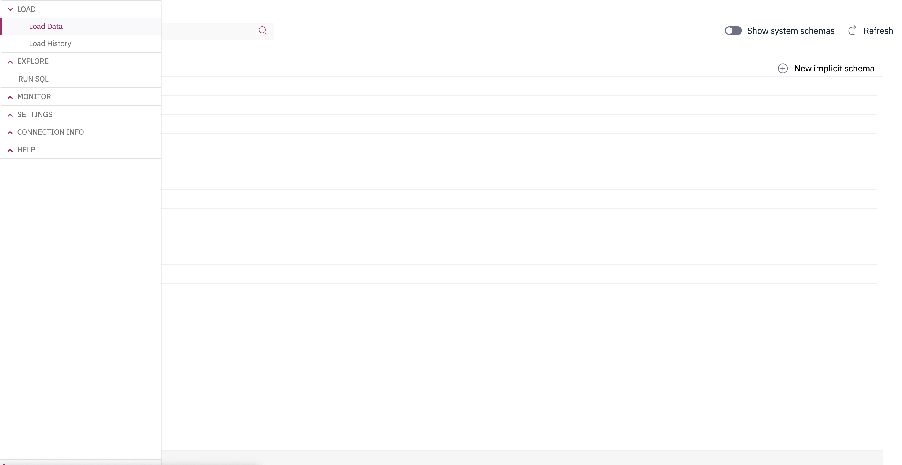
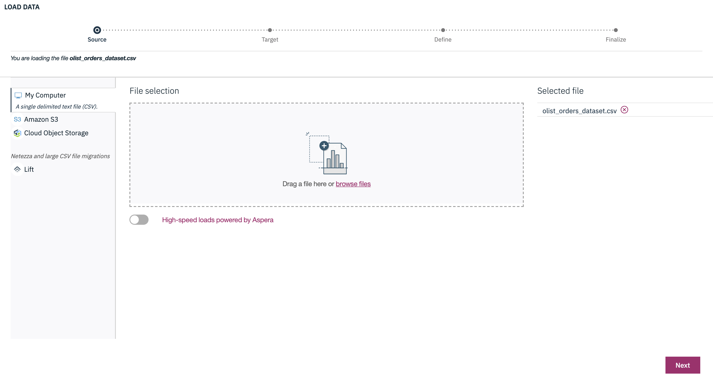
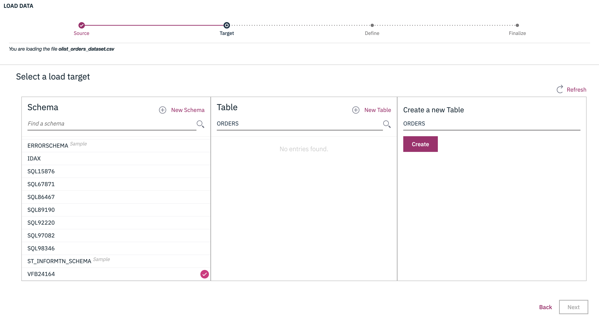
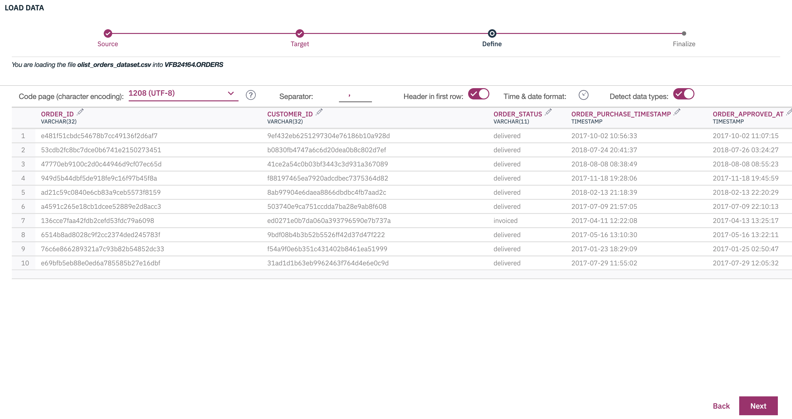
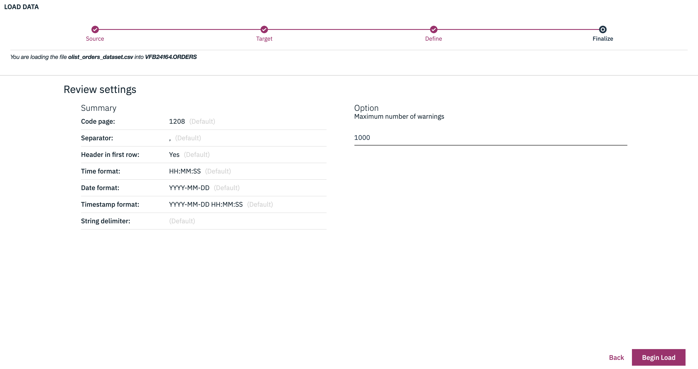
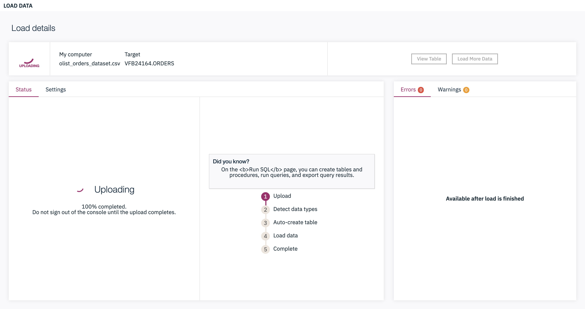
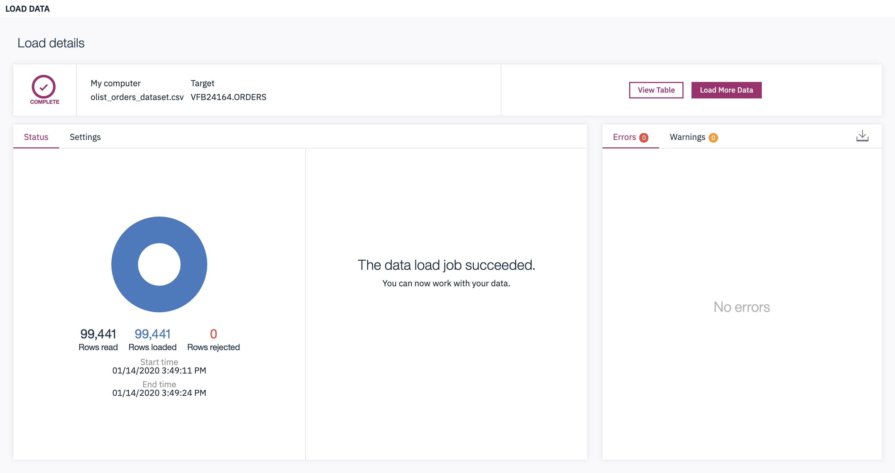
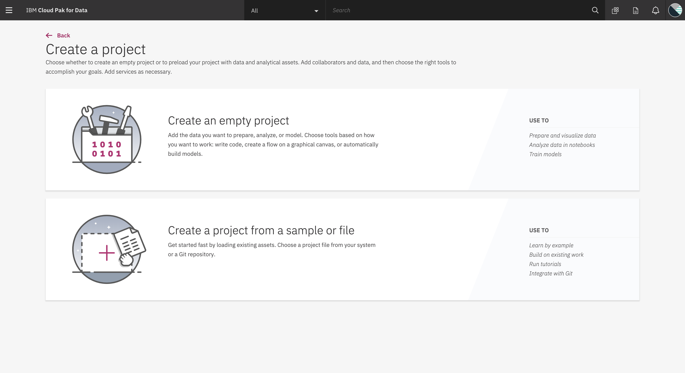
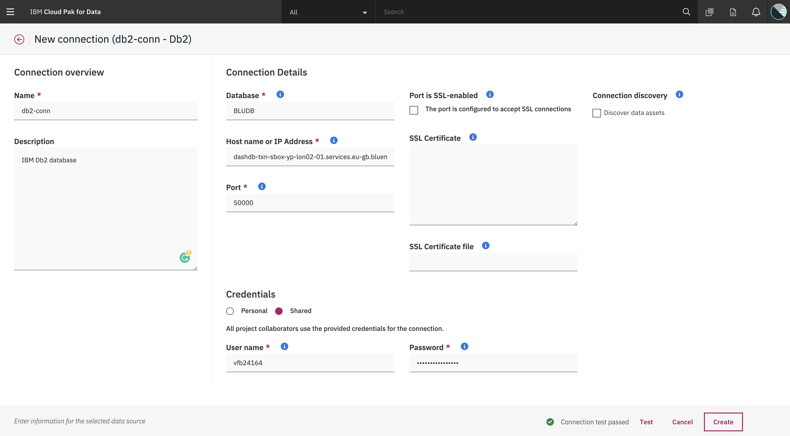

# Prepare your Dataset for your ML Models using Data Refinery from Db2 on Cloud Pak for Data

In this Tutorial, we will perform Data Engineering operations on multiple datasets using Watson Data Refinery on Cloud Pak for Data. 

A Data Scientist cannot directly build a model based on the dataset, the data collection and analysis is very essential before building a model. In this Tutorial we demonstrate how data scientists can easily collect data from databases, analyse the data and enhance the data according to their requirements with the help of Watson Data Refinery on Cloud Pak for Data.

When you have completed this code pattern, you will understand how to:

* Create a set of ordered steps to cleanse, shape, and enhance data. 
* Create a connection with any database and Data Refinery.
* Prepare datasets specific to your ML Model.
* Save the datasets in any database of your choice.

<!--add an image in this path-->

<!--Optionally, add flow steps based on the architecture diagram-->
## Flow

1. Create a connection to Db2.
2. Load the four tables in Data Refinery.
3. Join the four tables based on the primary keys and foreign keys.
4. Run the Data Refinery Job to save the joined Table in Db2.

<!--Optionally, update this section when the video is created-->
# Watch the Video

# Steps

1. [Download the Data](#1-download-the-data).
2. [Load the data into tables in Db2](#2-load-the-data-into-tables-in-db2).
3. [Create a Project in Cloud Pak for Data](#3-create-a-project-in-cloud-pak-for-data)
4. [Add Db2 connection to the project](#4-add-db2-connection-to-the-project).
5. [Add Data Refinery to the project and perform Data Engineering Operations](#5-add-data-refinery-to-the-project-and-perform-data-engineering-operations).
6. [Save the Enhanced Dataset to a table in Db2](#6-save-the-enhanced-dataset-to-a-table-in-db2).

### 1. Download the data.

In this Tutorial we are going to use **Brazilian E-Commerce Public Dataset by Olist** from Kaggle. Download the dataset from the link given below.

* https://www.kaggle.com/olistbr/brazilian-ecommerce

After Downloading, Extract the `brazilian-ecommerce.zip` file.

We’ll be using the following files: 
1. [`brazilian-ecommerce/olist_orders_dataset.csv`]() : This is the core dataset. From each order you might find all other information.

2. [`brazilian-ecommerce/olist_order_items_dataset.csv`]() : This dataset includes data about the items purchased within each order.

3. [`brazilian-ecommerce/olist_products_dataset.csv`]() : This dataset includes data about the products sold by Olist.

4. [`brazilian-ecommerce/olist_sellers_dataset.csv`]() : This dataset includes data about the sellers that fulfilled orders made at Olist.

### 2. Load the data into tables in Db2

**NOTE: We are Assuming you have already Provisioned a Db2 Instance in your Cloud Pak for Data. If you do not have Db2 Instance Provisioned you can also use other on-prem, public or private Databases of your choice and load the datasets.**

* Open the Db2 Instance and click on load data.

* Select the **olist_orders_dataset.csv** file and select next.

* Choose your namespace and create a table named **ORDERS** and select next.

* You can preview the metadata of the table and select next.

* Click on **Begin Load** to import the downloaded `.csv` file into your Db2.

* Wait for the upload to finish and then you can add the other three datasets in the similar way.

* Once the table is being created, click on **Load More Data** to add the other three datasets.

* The Other three tables that we will be creating are **ORDERITEMS, PRODUCTS & SELLER** .

* Load the olist_order_items_dataset.csv, olist_products_dataset.csv & olist_sellers_dataset.csv by repeating the above steps.

### 3. Create a Project in Cloud Pak for Data

Once the Database is ready, we will start using the database in our Cloud Pak for Data. 

* Create a Project in Cloud Pak for Data choose an Empty Project.

* Once The Project is Created you will see the below page.

### 4. Add Db2 connection to the project

Now that we have created a project, we will start adding components to our project. We will start by adding Db2 Connection to our project first.

* Click on **Add to Project** and select **Connection**. If you have followed [step 2](#2-load-the-data-into-tables-in-db2) select **Db2** from the list and add the credentials of your provisioned Db2 Instance. If you have a different database then you can select that and fill in the credentials.

* After filling the credentials click on **Test Connection** to make sure you have entered correct credentials. Finally select **Create**.

### 5. Add Data Refinery to the project

We will add Data Refinery Flow in the similar way.

* Click on **Add to Project** and select **Data Refinery Flow**. 

### 6. Save the Enhanced Dataset to a table in Db2

# Sample output

<!--Optionally, include any troubleshooting tips (driver issues, etc)-->

# Troubleshooting

* Error: Environment {GUID} is still not active, retry once status is active

  > This is common during the first run. The app tries to start before the Watson Discovery
environment is fully created. Allow a minute or two to pass. The environment should
be usable on restart. If you used **Deploy to IBM Cloud** the restart should be automatic.

* Error: Only one free environment is allowed per organization

  > To work with a free trial, a small free Watson Discovery environment is created. If you already have
a Watson Discovery environment, this will fail. If you are not using Watson Discovery, check for an old
service thay you might want to delete. Otherwise, use the `.env DISCOVERY_ENVIRONMENT_ID` to tell
the app which environment you want it to use. A collection will be created in this environment
using the default configuration.

<!-- keep this -->
## License

This code pattern is licensed under the Apache License, Version 2. Separate third-party code objects invoked within this code pattern are licensed by their respective providers pursuant to their own separate licenses. Contributions are subject to the [Developer Certificate of Origin, Version 1.1](https://developercertificate.org/) and the [Apache License, Version 2](https://www.apache.org/licenses/LICENSE-2.0.txt).

[Apache License FAQ](https://www.apache.org/foundation/license-faq.html#WhatDoesItMEAN)

